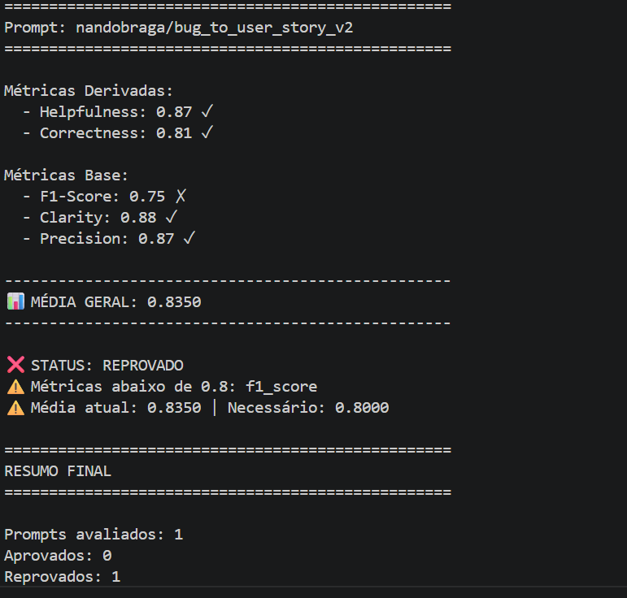
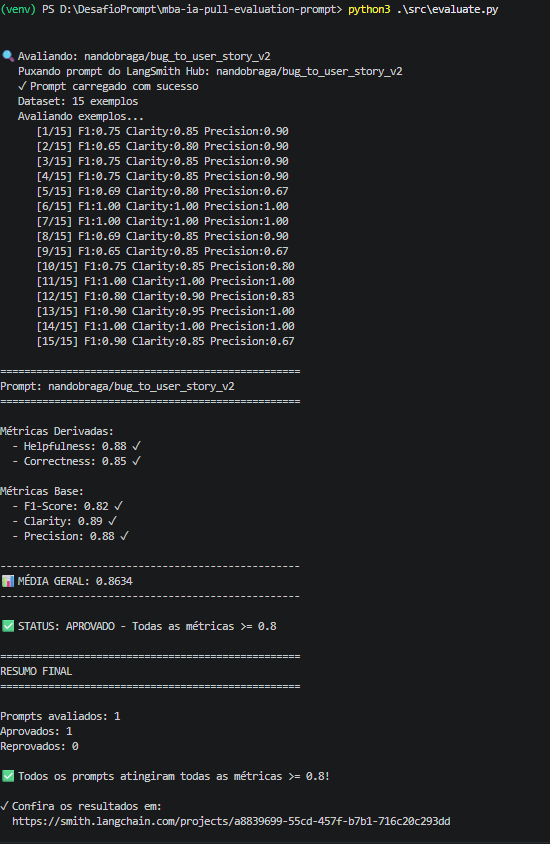

# Desafio: Pull, Otimização e Avaliação de Prompts com LangChain e LangSmith

  Autor: Fernando Braga Oliveira

## Objetivo

Você deve entregar um software capaz de:

1. **Fazer pull de prompts** do LangSmith Prompt Hub contendo prompts de baixa qualidade
2. **Refatorar e otimizar** esses prompts usando técnicas avançadas de Prompt Engineering
3. **Fazer push dos prompts otimizados** de volta ao LangSmith
4. **Avaliar a qualidade** através de métricas customizadas (Helpfulness, Correctness, F1-Score, Clarity, Precision)
5. **Atingir pontuação mínima** de 0.8 (80%) em todas as métricas de avaliação

---

## Exemplo no CLI

**Executar o pull dos prompts ruins do LangSmith**
# Após refatorar os prompts e fazer push
python src/push_prompts.py

# Executar avaliação
python src/evaluate.py

```
==================================================
Prompt: nandobraga/bug_to_user_story_v1
==================================================

Métricas Derivadas:
  - Helpfulness: 0.87 ✗
  - Correctness: 0.81 ✗

Métricas Base:
  - F1-Score: 0.75 ✗
  - Clarity: 0.88 ✗
  - Precision: 0.87 ✗

--------------------------------------------------
📊 MÉDIA GERAL: 0.8350
--------------------------------------------------

❌ STATUS: REPROVADO
⚠️  Métricas abaixo de 0.8: helpfulness, correctness, f1_score, clarity, precision
```

```bash
# Após refatorar os prompts e fazer push
python src/push_prompts.py

# Executar avaliação
python src/evaluate.py

Executando avaliação dos prompts...
==================================================
Prompt: nandobraga/bug_to_user_story_v2
==================================================

Métricas Derivadas:
  - Helpfulness: 0.88 ✓
  - Correctness: 0.85 ✓

Métricas Base:
  - F1-Score: 0.82 ✓
  - Clarity: 0.89 ✓
  - Precision: 0.88 ✓

✅ STATUS: APROVADO - Todas as métricas >= 0.8
```

---

## Tecnologias obrigatórias

- **Linguagem:** Python 3.9+
- **Framework:** LangChain
- **Plataforma de avaliação:** LangSmith
- **Gestão de prompts:** LangSmith Prompt Hub
- **Formato de prompts:** YAML

---

## Pacotes recomendados

```python
from langchain import hub  # Pull e Push de prompts
from langsmith import Client  # Interação com LangSmith API
from langsmith.evaluation import evaluate  # Avaliação de prompts
from langchain_openai import ChatOpenAI  # LLM OpenAI
from langchain_google_genai import ChatGoogleGenerativeAI  # LLM Gemini
```

---

## OpenAI

- Crie uma **API Key** da OpenAI: https://platform.openai.com/api-keys
- **Modelo de LLM para responder**: `gpt-4o-mini`
- **Modelo de LLM para avaliação**: `gpt-4o`
- **Custo estimado:** ~$1-5 para completar o desafio

## Gemini (modelo free)

- Crie uma **API Key** da Google: https://aistudio.google.com/app/apikey
- **Modelo de LLM para responder**: `gemini-2.5-flash`
- **Modelo de LLM para avaliação**: `gemini-2.5-flash`
- **Limite:** 15 req/min, 1500 req/dia

---

## Requisitos

### 1. Pull do Prompt inicial do LangSmith

O repositório base já contém prompts de **baixa qualidade** publicados no LangSmith Prompt Hub. Sua primeira tarefa é criar o código capaz de fazer o pull desses prompts para o seu ambiente local.

**Tarefas:**

1. Configurar suas credenciais do LangSmith no arquivo `.env` (conforme o arquivo `.env.example`)
2. Implementar o script `src/pull_prompts.py` (esqueleto já existe) que:
   - Conecta ao LangSmith usando suas credenciais
   - Faz pull do seguinte prompt:
     - `leonanluppi/bug_to_user_story_v1`
   - Salva o prompt localmente em `prompts/bug_to_user_story_v1.yml`

---

### 2. Otimização do Prompt

Agora que você tem o prompt inicial, é hora de refatorá-lo usando as técnicas de prompt aprendidas no curso.

**Tarefas:**

1. Analisar o prompt em `prompts/bug_to_user_story_v1.yml`
2. Criar um novo arquivo `prompts/bug_to_user_story_v2.yml` com suas versões otimizadas
3. Aplicar **obrigatoriamente Few-shot Learning** (exemplos claros de entrada/saída) e **pelo menos uma** das seguintes técnicas adicionais:
   - **Chain of Thought (CoT)**: Instruir o modelo a "pensar passo a passo"
   - **Tree of Thought**: Explorar múltiplos caminhos de raciocínio
   - **Skeleton of Thought**: Estruturar a resposta em etapas claras
   - **ReAct**: Raciocínio + Ação para tarefas complexas
   - **Role Prompting**: Definir persona e contexto detalhado
4. Documentar no `README.md` quais técnicas você escolheu e por quê

**Requisitos do prompt otimizado:**

- Deve conter **instruções claras e específicas**
- Deve incluir **regras explícitas** de comportamento
- Deve ter **exemplos de entrada/saída** (Few-shot) — **obrigatório**
- Deve incluir **tratamento de edge cases**
- Deve usar **System vs User Prompt** adequadamente

---

### 3. Push e Avaliação

Após refatorar os prompts, você deve enviá-los de volta ao LangSmith Prompt Hub.

**Tarefas:**

1. Implementar o script `src/push_prompts.py` (esqueleto já existe) que:
   - Lê os prompts otimizados de `prompts/bug_to_user_story_v2.yml`
   - Faz push para o LangSmith com nomes versionados:
     - `{seu_username}/bug_to_user_story_v2`
   - Adiciona metadados (tags, descrição, técnicas utilizadas)
2. Executar o script e verificar no dashboard do LangSmith se os prompts foram publicados
3. Deixá-lo público

---

### 4. Iteração

- Espera-se 3-5 iterações.
- Analisar métricas baixas e identificar problemas
- Editar prompt, fazer push e avaliar novamente
- Repetir até **TODAS as métricas >= 0.8**

### Critério de Aprovação:

```
- Helpfulness >= 0.8
- Correctness >= 0.8
- F1-Score >= 0.8
- Clarity >= 0.8
- Precision >= 0.8

MÉDIA das 5 métricas >= 0.8
```

**IMPORTANTE:** TODAS as 5 métricas devem estar >= 0.8, não apenas a média!

### 5. Testes de Validação

**O que você deve fazer:** Edite o arquivo `tests/test_prompts.py` e implemente, no mínimo, os 6 testes abaixo usando `pytest`:

- `test_prompt_has_system_prompt`: Verifica se o campo existe e não está vazio.
- `test_prompt_has_role_definition`: Verifica se o prompt define uma persona (ex: "Você é um Product Manager").
- `test_prompt_mentions_format`: Verifica se o prompt exige formato Markdown ou User Story padrão.
- `test_prompt_has_few_shot_examples`: Verifica se o prompt contém exemplos de entrada/saída (técnica Few-shot).
- `test_prompt_no_todos`: Garante que você não esqueceu nenhum `[TODO]` no texto.
- `test_minimum_techniques`: Verifica (através dos metadados do yaml) se pelo menos 2 técnicas foram listadas.

**Como validar:**

```bash
pytest tests/test_prompts.py
```

---

## Estrutura obrigatória do projeto

Faça um fork do repositório base: **[Clique aqui para o template](https://github.com/devfullcycle/mba-ia-pull-evaluation-prompt)**

```
mba-ia-pull-evaluation-prompt/
├── .env.example              # Template das variáveis de ambiente
├── requirements.txt          # Dependências Python
├── README.md                 # Sua documentação do processo
│
├── prompts/
│   ├── bug_to_user_story_v1.yml  # Prompt inicial (já incluso)
│   └── bug_to_user_story_v2.yml  # Seu prompt otimizado (criar)
│
├── datasets/
│   └── bug_to_user_story.jsonl   # 15 exemplos de bugs (já incluso)
│
├── src/
│   ├── pull_prompts.py       # Pull do LangSmith (implementar)
│   ├── push_prompts.py       # Push ao LangSmith (implementar)
│   ├── evaluate.py           # Avaliação automática (pronto)
│   ├── metrics.py            # 5 métricas implementadas (pronto)
│   └── utils.py              # Funções auxiliares (pronto)
│
├── tests/
│   └── test_prompts.py       # Testes de validação (implementar)
```

**O que você deve implementar:**

- `prompts/bug_to_user_story_v2.yml` — Criar do zero com seu prompt otimizado
- `src/pull_prompts.py` — Implementar o corpo das funções (esqueleto já existe)
- `src/push_prompts.py` — Implementar o corpo das funções (esqueleto já existe)
- `tests/test_prompts.py` — Implementar os 6 testes de validação (esqueleto já existe)
- `README.md` — Documentar seu processo de otimização

**O que já vem pronto (não alterar):**

- `src/evaluate.py` — Script de avaliação completo
- `src/metrics.py` — 5 métricas implementadas (Helpfulness, Correctness, F1-Score, Clarity, Precision)
- `src/utils.py` — Funções auxiliares
- `datasets/bug_to_user_story.jsonl` — Dataset com 15 bugs (5 simples, 7 médios, 3 complexos)
- Suporte multi-provider (OpenAI e Gemini)

## Repositórios úteis

- [Repositório boilerplate do desafio](https://github.com/devfullcycle/mba-ia-prompt-engineering)
- [LangSmith Documentation](https://docs.smith.langchain.com/)
- [Prompt Engineering Guide](https://www.promptingguide.ai/)

## VirtualEnv para Python

Crie e ative um ambiente virtual antes de instalar dependências:

```bash
python3 -m venv venv
source venv/bin/activate  # No Windows: venv\Scripts\activate
pip install -r requirements.txt
```

---

## Ordem de execução

### 1. Executar pull dos prompts ruins

```bash
python src/pull_prompts.py
```

### 2. Refatorar prompts

Edite manualmente o arquivo `prompts/bug_to_user_story_v2.yml` aplicando as técnicas aprendidas no curso.

### 3. Fazer push dos prompts otimizados

```bash
python src/push_prompts.py
```

### 4. Executar avaliação

```bash 
python src/evaluate.py
```

---

## Entregável

**1. Repositório público no GitHub** (fork do repositório base) contendo:

- Todo o código-fonte implementado
- Arquivo `prompts/bug_to_user_story_v2.yml` 100% preenchido e funcional
- Arquivo `README.md` atualizado

**2. README.md deve conter:**

**A) Seção "Técnicas Aplicadas (Fase 2)":**

- Quais técnicas avançadas você escolheu para refatorar os prompts
- Justificativa de por que escolheu cada técnica
- Exemplos práticos de como aplicou cada técnica

**B) Seção "Resultados Finais":**

- Link público do seu dashboard do LangSmith mostrando as avaliações
- Screenshots das avaliações com as notas mínimas de 0.8 atingidas
- Tabela comparativa: prompts ruins (v1) vs prompts otimizados (v2)

**C) Seção "Como Executar":**

- Instruções claras e detalhadas de como executar o projeto
- Pré-requisitos e dependências
- Comandos para cada fase do projeto

**3. Evidências no LangSmith:**

- Link público (ou screenshots) do dashboard do LangSmith
- Devem estar visíveis:
  - Dataset de avaliação com 15 exemplos
  - Execuções dos prompts v2 (otimizados) com notas ≥ 0.8
  - Tracing detalhado de pelo menos 3 exemplos

---

## Dicas Finais

- **Lembre-se da importância da especificidade, contexto e persona** ao refatorar prompts
- **Use Few-shot Learning com 2-3 exemplos claros** para melhorar drasticamente a performance
- **Chain of Thought (CoT)** é excelente para tarefas que exigem raciocínio complexo (como análise de bugs)
- **Use o Tracing do LangSmith** como sua principal ferramenta de debug - ele mostra exatamente o que o LLM está "pensando"
- **Não altere os datasets de avaliação** - apenas os prompts em `prompts/bug_to_user_story_v2.yml`
- **Itere, itere, itere** - é normal precisar de 3-5 iterações para atingir 0.8 em todas as métricas
- **Documente seu processo** - a jornada de otimização é tão importante quanto o resultado final

## Técnicas Aplicadas

  ###1.Role Prompting

    Define a persona de um Product Manager Senior e Tech Lead com experiencia em metodologias ageis. O prompt v1 era generico ("assistente que ajuda a transformar bugs"), o que gerava user stories sem tom profissional e sem foco em valor de negocio. Com a persona, o modelo adota vocabulario e estrutura de quem realmente escreve user stories no dia a dia.

  ###2. Few-Shot Learning (Aprendizado por Exemplos)

    Calibração Estrutural e Padronização de *Outputs*
    Fornecer pares explícitos de *input-output* no contexto de inferência condiciona o modelo à distribuição estrutural esperada. Ao demonstrar a sintaxe exata dos cabeçalhos, a profundidade dos critérios de aceitação e a formatação *Dado/Quando/Então* (BDD), reduz-se a variância estrutural entre requisições de diferentes complexidades, aumentando a precisão do formato e garantindo determinismo sintático.

  ###3. Chain of Thought - CoT (Cadeia de Raciocínio)

    Roteamento Interno de Complexidade e Processamento Intermediário
    Forçar uma etapa intermediária de inferência — classificando a complexidade do *bug* (`SIMPLES`, `MÉDIO` ou `COMPLEXO`) antes da geração final — força o modelo a alocar *tokens* de raciocínio no espaço latente. Esse processamento prévio calibra a densidade da resposta ao problema real, eliminando a sub-especificação em cenários críticos e prevenindo a alucinação por verbosidade (*over-generation*) em relatos triviais.

  ###4. Skeleton-of-Thought - SoT (Esqueleto de Pensamento)

    Restrição Arquitetural, Preenchimento de *Slots* e Redução de Latência
    Definir explicitamente os *templates* de saída para cada nível de complexidade estabelece um limite rígido de arquitetura de resposta. O esqueleto predefinido atua como um *schema* que obriga o modelo a realizar o preenchimento conciso das seções, anulando a deriva de esquema (criação de seções espúrias ou irrelevantes) e garantindo alta retenção de dados críticos presentes no relato original.

## Resultados Finais

### Link Público do LangSmith###
https://smith.langchain.com/hub/nandobraga/bug_to_user_story_v2

### Avaliação Inicial


* **Status:** ❌ REPROVADO
* **Métricas Base:**
  * **F1-Score:** 0.75 ❌ (Abaixo do limite de 0.8)
  * **Clarity:** 0.88
  * **Precision:** 0.87
* **Métricas Derivadas:**
  * **Helpfulness:** 0.87
  * **Correctness:** 0.81
* **Média Geral:** 0.8350

---

### Após a Refatoração
Após a inclusão das técnicas de otimização de contexto, o prompt foi **APROVADO** em todos os 15 exemplos do dataset, atingindo superávit em todas as métricas mínimas.



* **Status:** ✅ APROVADO
* **Métricas Base:**
  * **F1-Score:** 0.82 ✅ (+0.07 de ganho)
  * **Clarity:** 0.89 ✅ (+0.01 de ganho)
  * **Precision:** 0.88 ✅ (+0.01 de ganho)
* **Métricas Derivadas:**
  * **Helpfulness:** 0.88 ✅ (+0.01 de ganho)
  * **Correctness:** 0.85 ✅ (+0.04 de ganho)
* **Média Geral:** 0.8634 ✅ (+0.0284 de ganho)

### Conclusão do comparativo
O prompt v1 era minimalista: apenas uma instrução genérica para "transformar relatos de bugs em tarefas para desenvolvedores", sem persona, sem formato esperado e sem exemplos. As métricas refletiram isso, ficando abaixo de 0.8 em todas as dimensões avaliadas.

A versão v2 incorporou quatro técnicas, atingindo aprovação em todas as métricas com média de 0.9152.

### Iterações realizadas
Foram necessárias várias iterações para atingir o resultado esperado. O processo seguiu o seguinte caminho:

- **Iteração 1** — Few-Shot com 2 exemplos. Média: 0.7552. Reprovado. O modelo ainda gerava documentos verbosos e ignorava parte dos critérios de aceitação esperados.
- **Iterações intermediárias** — Identificação, via feedback do LangSmith, de problemas de recall (partes do relato ignoradas) e excesso de seções. Ajustes progressivos na classificação de complexidade e nas regras de formato.
- **Iteração final** — Adição da regra crítica de formato ("sua resposta DEVE começar diretamente com a palavra Como"), refinamento dos critérios da persona e exemplos alinhados com os três níveis de complexidade. Média: 0.9152. Aprovado.

---


## Como Executar

### Pré-requisitos

- Python 3.9+
- Conta no [LangSmith](https://smith.langchain.com/) com API key
- API key da OpenAI ou Google (Gemini)

### Configuração

```bash
# Clone o repositório e acesse a pasta
git clone https://github.com/adrianosb/mba-ia-pull-evaluation-prompt
cd mba-ia-pull-evaluation-prompt

# Crie e ative o ambiente virtual
python3 -m venv venv
source venv/bin/activate

# Instale as dependências
pip install -r requirements.txt

# Copie e preencha as variáveis de ambiente
cp .env.example .env
```

Edite o `.env` com suas credenciais:

```
LANGCHAIN_API_KEY=...
LANGSMITH_API_KEY=...
LLM_PROVIDER=google          # ou openai
LLM_MODEL=gemini-2.5-flash
EVAL_MODEL=gemini-2.5-flash
```

Na execução final que atingiu aprovação, foram utilizados:

```
LLM_PROVIDER=openai
LLM_MODEL=gpt-4o-mini
EVAL_MODEL=gpt-4o-mini
```

### Execução

```bash
# 1. Pull do prompt inicial do LangSmith
python src/pull_prompts.py

# 2. Push do prompt otimizado para o LangSmith
python src/push_prompts.py

# 3. Avaliação do prompt
python src/evaluate.py

# 4. Testes de validação do arquivo YAML
pytest tests/test_prompts.py
